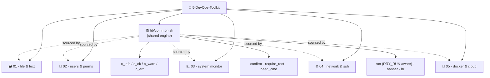

<div align="center">

# 🧰 5-DevOps-Toolkit

### `5 folders` · `25 single-purpose tools` · `1 shared engine` · `53 tests` · `5 green CI checks`

**Turning a raw Linux command cheat-sheet into a working, guarded DevOps toolkit.**
*הופך רשימת פקודות לינוקס גולמית לערכת כלים אמיתית, מסודרת ומוגנת.*

<br/>

[](https://github.com/www8351/5-DevOps-Toolkit/actions/workflows/shellcheck.yml)
[](https://github.com/www8351/5-DevOps-Toolkit/actions/workflows/python.yml)
<br/>


<br/>


</div>

---

## 🌍 What is this? · מה זה?

<table>
<tr>
<td width="50%" valign="top">

### 🇬🇧 English

This repository is a **portfolio of small, sharp shell scripts** built from a hand-written list of Linux,
networking, Docker and AWS commands.

Instead of one giant script, the commands are composed into **25 focused tools** spread across **5 themed
folders**. Every tool does *one* thing well, sources a **shared engine** (`lib/common.sh`), and ships with
help text, dependency checks and safety guards.

The point isn't the commands themselves it's the **assembly**: how primitives like `find`, `awk`, `du`,
`docker` and `nmap` are wired into reliable, reusable tools.

</td>
<td width="50%" valign="top">

<div dir="rtl">

### 🇮🇱 עברית

המאגר הזה הוא **תיק עבודות של סקריפטים קטנים וחדים** שנבנו מתוך רשימת פקודות לינוקס, רשת, Docker ו-AWS
שנכתבה ביד.

במקום סקריפט ענק אחד, הפקודות מורכבות ל-**25 כלים ממוקדים** הפרוסים על פני **5 תיקיות נושאיות**. כל כלי
עושה *דבר אחד* טוב, טוען **מנוע משותף** (`lib/common.sh`), ומגיע עם מסך עזרה, בדיקות תלויות ומנגנוני
הגנה.

העיקר הוא לא הפקודות עצמן אלא **ההרכבה**: איך אבני בניין כמו `find`, `awk`, `du`, `docker` ו-`nmap`
מחוברות לכלים אמינים שאפשר לעשות בהם שימוש חוזר.

</div>

</td>
</tr>
</table>

---

## 🗂️ The 5 Modules

| # | Folder | Focus | Scripts | Key commands |
|:-:|--------|-------|:-------:|--------------|
| 🗃️ **01** | [`01-file-text-toolkit`](01-file-text-toolkit/) | files & text plumbing | 5 | `du` `grep` `awk` `find` `tar` |
| 👤 **02** | [`02-user-permissions`](02-user-permissions/) | users, groups & permissions | 5 | `useradd` `chmod` `chown` `usermod` |
| 📊 **03** | [`03-system-monitor`](03-system-monitor/) | system & hardware | 5 | `lscpu` `df` `free` `ps` `swapon` |
| 🌐 **04** | [`04-network-ssh`](04-network-ssh/) | networking & SSH | 5 | `ip` `ss` `nmap` `curl` `ssh-keygen` |
| 🐳 **05** | [`05-docker-devops`](05-docker-devops/) | Docker, packages & cloud | 5 | `docker` `apt` `boto3` |

---

## 🧬 Architecture



Every script `source`s **`lib/common.sh`** a single shared engine that provides coloured logging,
`confirm` prompts, `require_root` / `need_cmd` guards and a `run` wrapper that honours `DRY_RUN=1`. One
library, 25 consumers **DRY by design**, not copy-paste.

---

## 🚀 Quick start

```bash
# 1. clone
git clone https://github.com/www8351/5-DevOps-Toolkit.git
cd 5-DevOps-Toolkit

# 2. make the scripts executable (Linux / WSL / macOS)
chmod +x lib/common.sh **/*.sh

# 3. every script self-documents
./01-file-text-toolkit/dirsnap.sh --help

# 4. run something harmless
./01-file-text-toolkit/dirsnap.sh -n 5 .
./03-system-monitor/sysinfo.sh
./04-network-ssh/httpcheck.sh https://github.com https://example.com

# 5. preview a destructive tool WITHOUT touching the system
DRY_RUN=1 ./03-system-monitor/mkswap.sh -s 1G -f /swapfile
```

> 🪟 **Windows users:** the commands target **Linux**. Run the read-only scripts in **Git Bash**, and the
> system/root scripts inside **WSL** or a Linux VM.

---

## 🛡️ Safety model

Every script follows the same defensive contract:

- `set -euo pipefail` — fail fast, fail loud.
- **`-h` / `--help`** on every tool.
- **`need_cmd`** aborts early if a required binary is missing.
- **`require_root`** refuses to run privileged tools as a normal user.
- **`confirm`** asks before any destructive action — bypass in CI with `ASSUME_YES=1`.
- **`DRY_RUN=1`** prints what *would* happen instead of doing it.

> Two files in `04-network-ssh/` are helpers rather than tools and are exempt from the `-h`
> contract on purpose: `name_echo.sh` (an interactive demo) and `setup.sh` (a venv
> bootstrapper for `ssh_toolkit`). The bats smoke test skips exactly those two and enforces the
> contract on everything else.

---

## 🔬 Quality & CI

This isn't a script dump it's an engineered repo. Every push and pull request runs **5 CI checks**;
a green tick means the whole toolkit is clean.

| Check | What it guarantees |
|-------|--------------------|
| **shellcheck + `bash -n`** | every `*.sh` is syntax-clean and shellcheck-clean (`-e SC1091`) |
| **bats** | 24 unit tests over `lib/common.sh` + the *“`-h` works before dependency checks”* contract |
| **pytest** | 29 tests over `ssh_toolkit.utils` OS detection, config precedence, rollback stack |
| **py_compile + ruff** | the Python compiles and passes real-error lint |
| **makefile** | the `Makefile` parses and every target resolves (`make -n all`) |

**53 tests total, all VM-free.** The engineering process is documented in the lifecycle log:
decisions and their rationale in [`DECISIONS.md`](DECISIONS.md), current state in [`STATUS.md`](STATUS.md),
and a dated history in [`PROGRESS.md`](PROGRESS.md).

---

## 🛠️ Development

Linters and tests mirror CI. Use **`make`** on Linux/WSL/macOS or **`tasks.ps1`** on Windows —
identical target names. Install dev deps first: `pip install -r requirements-dev.txt`
(shell tests also need `bats` and `shellcheck`, e.g. `sudo apt install bats shellcheck`).

```bash
# Linux / WSL / macOS
make help          # list targets
make lint          # bash -n + shellcheck + ruff
make test          # bats + pytest
make all           # lint + test
```

```powershell
# Windows (PowerShell) — tools absent on Windows are skipped with a warning
.\tasks.ps1 lint   # runs ruff; bash -n / shellcheck skipped on Windows (run in CI)
.\tasks.ps1 test   # runs pytest; bats skipped on Windows (runs in CI)
```

| Target | Runs |
|--------|------|
| `lint` | `bash -n`, `shellcheck` (`-e SC1091`), `ruff` (real errors only) |
| `test` | `bats tests/bats`, `pytest 04-network-ssh/tests` |
| `all`  | `lint` then `test` |

---

## 🗺️ Roadmap

**Shipped**

- ✅ 25 guarded tools across 5 modules on one shared engine (`lib/common.sh`)
      (24 shell scripts + one Python tool, `05/ec2-deploy.py`)
- ✅ `ssh_toolkit` cross-platform (Windows / macOS / Linux) Python SSH automation
- ✅ Bilingual (HE / EN) documentation, published to GitHub
- ✅ **CI** shellcheck + bats + pytest + ruff + Makefile-parse on every push & PR
- ✅ **53 tests** (24 bats + 29 pytest), all VM-free
- ✅ **Task runner** — `make` (Linux / WSL / macOS) and `tasks.ps1` (Windows), same targets
- ✅ Contributor docs [`CONTRIBUTING.md`](CONTRIBUTING.md), plus a read-only demo tour ([`docs/demo.sh`](docs/demo.sh))

**Planned**

- ⬜ Record the demo GIF ([`docs/DEMO.md`](docs/DEMO.md)) and embed it under the badges
- ⬜ Validate `ssh_toolkit` end-to-end against a live two-VM lab
- 💡 Widen bats coverage to the module scripts; tighten the `ruff` ruleset once a baseline is clean
- 💡 Add `bats` / `pytest` status badges when a coverage step lands

> The 4-phase hardening (CI → tests → task runner → docs) landed as small, per-phase commits — the
> `git log` reads like a progress timeline on purpose.

---

<details>
<summary><b>🧠 Skills demonstrated</b> (click to expand)</summary>

<br/>

- **Text processing pipelines** — `grep | awk | sort | uniq | cut | wc` composition.
- **Filesystem reasoning** — `find` by type/size/permission, `du` rollups, `tar` archiving.
- **Linux administration** users, groups, ownership, mode bits, swap, services.
- **Observability** CPU / memory / disk dashboards and threshold alerts with cron-friendly exit codes.
- **Networking** interface & route inspection, host sweeps, endpoint health, port scanning, SSH keys.
- **Containers & cloud** distro-agnostic package wrapper, Docker run/clean, Jenkins install, boto3 EC2.
- **Software engineering** a shared library, consistent CLIs, guards, dry-run, and shellcheck hygiene.
- **Testing & CI** bats + pytest (53 cases), GitHub Actions on every push, a Makefile/PowerShell task runner.
- **Process discipline** a maintained decision log and status/progress files; each change lands as a small, reviewable commit.

</details>

<details>
<summary><b>🗺️ Command → script index</b> (click to expand)</summary>

<br/>

| Command | Where it lives |
|---------|----------------|
| `du` `sort` `head` `find` | `01/dirsnap.sh`, `01/bigfiles.sh` |
| `grep` `awk` `uniq` `cut` `wc` | `01/logtop.sh` |
| `wc` `head` `tail` | `01/txtstats.sh` |
| `tar` | `01/backup.sh` |
| `useradd` `passwd` | `02/newuser.sh` |
| `/etc/passwd` `/etc/group` `id` | `02/whohas.sh` |
| `chmod` `chown` | `02/permfix.sh` |
| `find -perm` (SUID/SGID) | `02/audit-perms.sh` |
| `usermod -aG` | `02/grant-sudo.sh` |
| `uname` `hostnamectl` `lscpu` `df` `free` | `03/sysinfo.sh` |
| `ps aux` | `03/topproc.sh` |
| `df` thresholds | `03/diskwatch.sh` |
| `free` `swapon` | `03/memwatch.sh` |
| `fallocate` `mkswap` `swapon` | `03/mkswap.sh` |
| `ip addr` `ip route` `ss` | `04/netinfo.sh` |
| `ping` | `04/pingsweep.sh` |
| `curl` `wget` | `04/httpcheck.sh` |
| `nmap` | `04/portscan.sh` |
| `ssh-keygen` `ssh-copy-id` | `04/sshkey.sh` |
| `apt` `yum` `dnf` | `05/pkg.sh` |
| `docker run/inspect` | `05/docker-run-web.sh` |
| `docker rm/rmi` | `05/docker-clean.sh` |
| `jenkins` `systemctl` `ufw` | `05/install-jenkins.sh` |
| `boto3` EC2 | `05/ec2-deploy.py` |

</details>

---

## 🌳 Repository layout

```
5-DevOps-Toolkit/
├── lib/
│   └── common.sh              # shared engine: logging, guards, run/confirm
├── 01-file-text-toolkit/      # dirsnap · logtop · bigfiles · txtstats · backup
├── 02-user-permissions/       # newuser · whohas · permfix · audit-perms · grant-sudo
├── 03-system-monitor/         # sysinfo · topproc · diskwatch · memwatch · mkswap
├── 04-network-ssh/            # netinfo · pingsweep · httpcheck · portscan · sshkey · ssh_toolkit/ (py)
├── 05-docker-devops/          # pkg · docker-run-web · docker-clean · install-jenkins · ec2-deploy.py
├── tests/bats/                # bats tests for lib/common.sh + the -h contract
├── docs/                      # demo.sh (read-only tour) · DEMO.md (recording guide)
├── .github/workflows/         # shellcheck · bats · makefile · python · pytest CI
├── Makefile  tasks.ps1        # dev task runner (Linux/WSL · Windows)
├── requirements-dev.txt       # pytest + ruff
├── README.md  CONTRIBUTING.md # you are here · how to contribute
├── STATUS.md  PROGRESS.md  DECISIONS.md  CLAUDE_MEMORY.md   # project lifecycle log
├── LICENSE                    # MIT
└── .gitignore  .editorconfig
```

---

<div align="center">

**Built by [@www8351](https://github.com/www8351)** · Licensed under [MIT](LICENSE)

<sub>Each script is small on purpose. The craft is in how they fit together.</sub>

</div>
